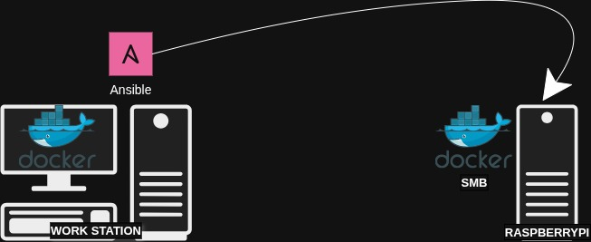

# HOME LAB

## DESCRIPCIÓN
Infraestructura de contenedores Docker que prestará diferentes servicios y aplicaciones a modo de laboratorio.

## HARDWARE INICIAL

- Raspberry Pi 5 Model B Rev 1.0
    - OS: Ubuntu 24.04.2 LTS
    - Serial: 50536dfdf819d147
    - CPU: 64 bits
    - Architecture: aarch64
    - Mem: 8 Gbps

## INSTALACIONES INICIALES EN EL RASPBERRYPI

El primer paso sería establecer una dirección IP fija para nuestro `Raspberry Pi 5`
- Hostname: `rodo-raspberrypi`
- Usuario Sudo: `rodo`
- Dirección IP: `192.168.1.11`

Luego procederíamos con lo siguiente:

### Servidor SSH
Instalamos **OPENSSH**
```bash
# Primero el cliente en caso no venga por defecto
sudo apt install openssh-client
# Luego el servidor
sudo apt install openssh-server
# Reiniciamos el servicio
sudo systemctl restart ssh.service
```

Verificamos si el puerto `22` está escuchando:
```bash
# Instalamos
sudo apt install net-tools
# Verificamos
netstat -lpn
```

Para conectarnos sin la necesidad de usar usuario y contraseña, podemos hacer uso de nuestras llaves.
Considerando que en nuestra máquina local ya tenemos llaves, podemos enviar la llave pública al archivo `~/.ssh/authorized_keys` de la siguiente manera:

```bash
# Desde nuestra máquina local
# [Máquina Local] ===> [Raspberry Pi]
ssh-copy-id rodo@192.168.1.11
```

### Instalando Docker en el RaspberryPi
Considerando lo antes descrito [aquí](#hardware-inicial)
Procederemos a instalar **Docker:**
[Docker en Ubuntu](https://docs.docker.com/engine/install/ubuntu/)

Recordemos de añadir a nuestro usuario en el grupo `docker`
```bash
sudo usermod -aG docker rodo
```

## NOTAS MISC
Para probar contenedor
```bash
docker run --rm -it -d --entrypoint "/bin/bash" 0a6baaa4e7b6 -c "tail -f /dev/null"
docker exec -it bee /bin/bash
```

Para crear roles
```bash
ansible-galaxy init [role-name]
```

Puertos del SMB
- 445
- 139

## DESPLIEGUE DE CONTENEDORES EN EL RASPBERRY PI DESDE UN CONTENEDOR LOCAL ANSIBLE
Tal y como lo describe el título, el objetivo aquí es:
- Desde nuestra máquina local, crearemos y correremos un contenedor que a su vez ejecuta una o una serie de tareas descritas en un `Ansible-playbook`
- Dicho `playbook` enviará una serie de tareas dirigidas hacia el `RaspberryPi`
- El primer rol del `Ansible-playbook` que se desplegará sera `Samba`

### Samba Server
EL primer rol que se despliega hacia el `RaspberryPi` a modo de contenedor es un servidor `Samba`



