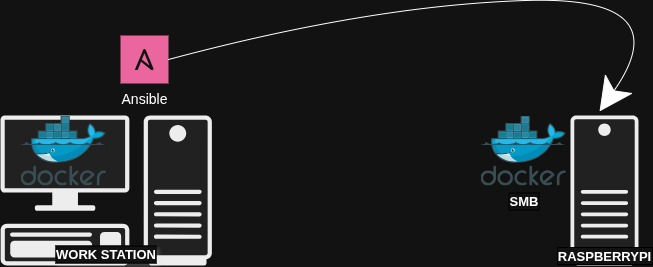

# HOME LAB

## DESCRIPCIÓN
Infraestructura de contenedores Docker que prestará diferentes servicios y aplicaciones a modo de laboratorio.

## HARDWARE INICIAL

- Raspberry Pi 5 Model B Rev 1.0
    - OS: Ubuntu 24.04.2 LTS
    - Serial: 50536dfdf819d147
    - CPU: 64 bits
    - Architecture: aarch64
    - Mem: 8 Gbps

## INSTALACIONES INICIALES EN EL RASPBERRYPI

El primer paso sería establecer una dirección IP fija para nuestro `Raspberry Pi 5`
- Hostname: `rodo-raspberrypi`
- Usuario Sudo: `rodo`
- Dirección IP: `192.168.1.11`

Luego procederíamos con lo siguiente:

### Servidor SSH
Instalamos **OPENSSH**
```bash
# Primero el cliente en caso no venga por defecto
sudo apt install openssh-client
# Luego el servidor
sudo apt install openssh-server
# Reiniciamos el servicio
sudo systemctl restart ssh.service
```

Verificamos si el puerto `22` está escuchando:
```bash
# Instalamos
sudo apt install net-tools
# Verificamos
netstat -lpn
```

Para conectarnos sin la necesidad de usar usuario y contraseña, podemos hacer uso de nuestras llaves.
Considerando que en nuestra máquina local ya tenemos llaves, podemos enviar la llave pública al archivo `~/.ssh/authorized_keys` de la siguiente manera:

```bash
# Desde nuestra máquina local
# [Máquina Local] ===> [Raspberry Pi]
ssh-copy-id rodo@192.168.1.11
```

### Instalando Docker en el RaspberryPi
Considerando lo antes descrito [aquí](#hardware-inicial)
Procederemos a instalar **Docker:**
[Docker en Ubuntu](https://docs.docker.com/engine/install/ubuntu/)

Recordemos de añadir a nuestro usuario en el grupo `docker`
```bash
sudo usermod -aG docker rodo
```

## NOTAS MISC
Para probar contenedor
```bash
docker run --rm -it -d --entrypoint "/bin/bash" 0a6baaa4e7b6 -c "tail -f /dev/null"
docker exec -it bee /bin/bash
```

Para crear roles
```bash
ansible-galaxy init [role-name]
```

Puertos del SMB
- 445
- 139

## DESPLIEGUE DE CONTENEDORES EN EL RASPBERRY PI DESDE UN CONTENEDOR LOCAL ANSIBLE
Tal y como lo describe el título, el objetivo aquí es:
- Desde nuestra máquina local, crearemos y correremos un contenedor que a su vez ejecuta una o una serie de tareas descritas en un `Ansible-playbook`
- Dicho `playbook` enviará una serie de tareas dirigidas hacia el `RaspberryPi`
- El primer rol del `Ansible-playbook` que se desplegará sera `Samba`

A continuación veremos los pasos que se siguen para que se logre todo este proceso:
Como primer paso construiremos de forma local una imagen de `Docker` utilizando el script [build-myhomelab.sh](./build-myhomelab.sh):
```bash
# Construimos la imagen Docker
./build-myhomelab.sh
```
Este script tiene varias cosas interesantes.
Para comenzar utiliza un archivo llamado [variables.env](./variables.env) para obtener diferentes variables de entorno que se van a necesitar durante el proceso de creación.

Además, le estamos diciendo que comparta mis llaves locales con el contenedor `--ssh default=$HOME/.ssh/id_ed25519`. Es decir, el contenedor podrá utilizar dichas llaves para poder conectarse con el `raspberryPi`. Recordemos que en pasos anteriores, le habíamos enviado nuestras llaves públicas al `raspberryPi`

Naturalmente, este contenedor se basa en el [Dockerfile](./Dockerfile) donde podemos observar que luego de instalar algunos programas como `Ansible` y copiar algunos otros archivos, procede a ejecutar un `entrypoint`. Ya sabemos que el `entrypoint` va a correr no durante la construcción del contenedor, sino mas bien durante la ejecución del mismo.

Entonces, lo que se manda a ejecutar en dicho momento, es otro script llamado [myhomelab-playbook.sh](./myhomelab-playbook.sh).
Es con este script que luego de una serie de comandos para no tener problemas con las llaves y la conexión `ssh`, procede a llamar al [ansible-playbook](./ansible/myhomelab-playbook.yaml) junto a una serie de variables y al [inventario](./ansible/inventory.ini) que es en este caso, simplemente la dirección IP del `raspberryPi`.

Finalmente, [myhomelab-playbook.yaml](./ansible/myhomelab-playbook.yaml) es quien sigue una secuencia de tareas ordenada por `roles`.

### ROL: Samba Server
EL primer rol que se despliega hacia el `RaspberryPi` a modo de contenedor es un servidor `Samba`



### ROL: Jellyfin

### STACK: Reverse Proxy + Vaultwarden

Esta solución publica Vaultwarden de forma segura a través de un reverse proxy
Nginx ejecutado en un contenedor independiente dentro del Raspberry Pi.

#### Resumen del stack

| Capa | Tecnología | Responsabilidad |
| --- | --- | --- |
| Hardware | Raspberry Pi 5, aarch64 | Ejecuta los servicios en Ubuntu 24.04.2 LTS |
| Automatización | Ansible | Copia archivos, certificados y configuraciones; construye y ejecuta los contenedores |
| Runtime | Docker | Aísla los servicios y conecta ambos contenedores |
| Red | Docker bridge `homelab` | Permite que el proxy resuelva Vaultwarden por el nombre `vaultwarden` |
| Reverse proxy | Nginx Alpine | Atiende HTTP/HTTPS, redirige HTTP a HTTPS y reenvía las peticiones |
| Aplicación | `vaultwarden/server:latest` | Proporciona el servidor compatible con Bitwarden |
| Persistencia | `/home/rodrigo/secrets/:/data` | Conserva los datos de Vaultwarden fuera del contenedor |

#### Flujo de una petición


```mermaid
flowchart LR
     client[Cliente Bitwarden] -->|HTTP :80| proxy[Nginx reverse proxy]
     client -->|HTTPS :443| proxy
     proxy -->|301 Redirect| tls[HTTPS]
     tls -->|Docker network homelab\nhttp://vaultwarden:80| vault[Vaultwarden]
     vault --> data[( /home/rodrigo/secrets )]
```

1. El cliente accede a `bw.local` o a `192.168.1.11`.
2. Nginx recibe el tráfico HTTP en el puerto `80` y lo redirige a HTTPS.
3. Nginx termina TLS en el puerto `443` usando los certificados instalados en
    `/etc/nginx/certs/`.
4. Nginx reenvía el tráfico internamente a `http://vaultwarden:80` mediante la
    red Docker `homelab`.
5. Vaultwarden almacena sus datos en el volumen montado en `/data`.

#### Certificados

Los certificados TLS autofirmados se copian al directorio de construcción del
reverse proxy y se incluyen en la imagen Nginx:

- `cert.pem` -> `/etc/nginx/certs/cert.pem`
- `cert.key` -> `/etc/nginx/certs/cert.key`

La configuración de Nginx utiliza estos archivos para HTTPS y establece los
headers `Host`, `X-Real-IP`, `X-Forwarded-For` y `X-Forwarded-Proto` al
comunicarse con Vaultwarden.

#### Despliegue

El playbook ejecuta los roles en este orden:

```yaml
- { role: vault, tags: ['vault'] }
- { role: reverse-proxy, tags: ['reverse-proxy'] }
```

El rol `vault` descarga `vaultwarden/server:latest` cuando es necesario y
ejecuta el contenedor en la red `homelab`. El rol `reverse-proxy` copia el
Dockerfile, la configuración y los certificados, construye la imagen
`reverse-proxy:1.0` y publica los puertos `80` y `443` del Raspberry Pi.


